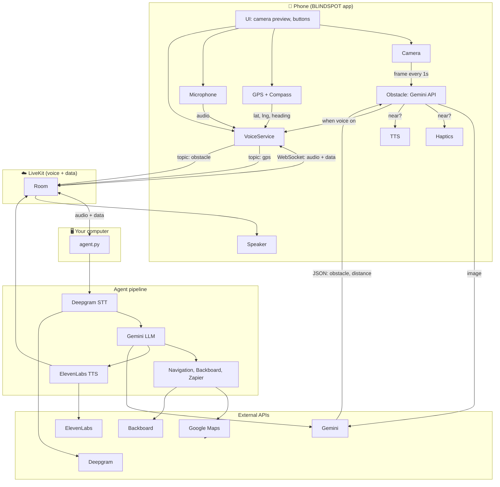

# BLINDSPOT

**BLINDSPOT** is a Flutter app for assistive walking navigation: live camera, GPS, **voice agent** (turn-by-turn, “where am I?”, nearby search), **obstacle detection** (haptics + voice), and haptics. Built for blind and low-vision users.

---

## Architecture: how the pieces connect

All working components and data flow:

**In words:**

| From | To | What |
|------|----|------|
| **Phone** | **LiveKit** | Microphone audio, GPS (topic `gps`), obstacle alerts when near (topic `obstacle`) |
| **LiveKit** | **Phone** | Agent’s voice (TTS audio) |
| **LiveKit** | **agent.py** | When the app joins a room, LiveKit runs your worker; it joins the same room and gets mic + data |
| **agent.py** | **LiveKit** | Synthesized speech (ElevenLabs) and any “say” (e.g. turn-by-turn, obstacle phrase) |
| **Phone** | **Gemini** | Camera frame (if using in-app obstacle detection) → JSON with `obstacle_detected`, `distance`, `description` |
| **agent.py** | **APIs** | Deepgram (STT), Gemini (LLM), ElevenLabs (TTS), Google Maps (navigation), Backboard (memory), optional Zapier |

Optional variant: the app can **POST** camera frames to **your own obstacle server** instead of calling Gemini directly; that server would call Gemini and return the same JSON.

---

## Component overview

| Component | Runs on | Role |
|-----------|---------|------|
| **BLINDSPOT app** | Phone / simulator | Camera, GPS, LiveKit client (mic + data), in-app obstacle (Gemini), haptics, TTS for obstacles |
| **LiveKit** | Cloud (or self-hosted) | Real-time voice + data between app and agent |
| **agent.py** | Your machine (via LiveKit) | Voice assistant: STT → LLM → TTS, navigation tools, obstacle voice alert, memory |

---

## What you need to run

1. **agent.py** (voice backend)  
   - **For phone/simulator:** `./run_agent.sh` or `uv run agent.py dev` — registers with LiveKit so the app can connect.
   - **For local mic/speaker testing only:** `uv run agent.py console` — does not connect to LiveKit; phone will not get agent response.
   - **Config:** `.env.local` (see [CONFIG.md](CONFIG.md)) + **`agent_config.py`** (prompts, model, VAD, greeting).

2. **BLINDSPOT app**  
   - **Run:** `flutter run` (device or simulator).  
   - **Config:** **`lib/config.dart`** (API keys, LiveKit, obstacle model/prompt/params).  
   - **Token:** Either **in-app** (set LiveKit URL + key + secret in `lib/config.dart`) or your own token server URL.

No separate token server or obstacle server is required: the app can generate the LiveKit token itself and run obstacle detection in-app with Gemini.

---

## Configuration at a glance

| What | Where |
|------|--------|
| **All API keys** (what they’re for, where to set them) | [CONFIG.md](CONFIG.md) |
| **Voice agent** (instructions, LLM/STT/TTS, VAD, greeting) | **`agent_config.py`** |
| **Object detection** (model, prompt, interval, sensitivity) | **`lib/config.dart`** |

---

## Getting started

1. **Backend (required for phone)**  
   - Copy `.env.local.template` → `.env.local` and fill in keys (see [CONFIG.md](CONFIG.md)).  
   - Run: `./run_agent.sh` or `uv run agent.py dev` (use `console` only for local mic/speaker testing).

2. **App**  
   - Set LiveKit (and optional `GOOGLE_API_KEY` for in-app obstacle) in `lib/config.dart` or via `--dart-define`.  
   - Run: `flutter run` (BLINDSPOT).

3. On the phone: enable **voice** (mic) and optionally **obstacle** (camera → haptics + voice). Ask “Where am I?” or “Navigate to [address]” / “Take me to the nearest coffee shop.”

---

## Flutter resources

[First Flutter app](https://docs.flutter.dev/get-started/codelab) · [Cookbook](https://docs.flutter.dev/cookbook) · [Documentation](https://docs.flutter.dev/)
