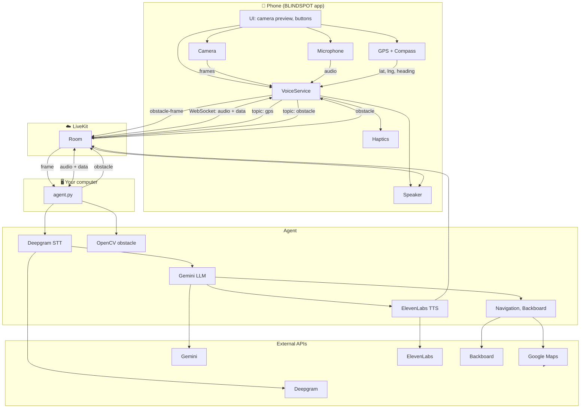

# BLINDSPOT

**BLINDSPOT** is a Flutter app for assistive walking navigation: live camera, GPS, **voice agent** (turn-by-turn, “where am I?”, nearby search), **obstacle detection** (OpenCV, haptics + voice). Built for blind and low-vision users.

---

## Project structure

| Path | Purpose |
|------|---------|
| `agent.py` | Voice agent (LiveKit worker) |
| `agent_config.py` | Prompts, LLM/STT/TTS/VAD |
| `obstacle.py` | Obstacle detection (OpenCV) |
| `google_maps.py`, `navigation.py` | Navigation |
| `backboard_store.py` | Memory |
| `scripts/download_yolov8n_onnx.py` | Export YOLOv8n ONNX |
| `lib/` | Flutter app |

## Architecture

Data flow:

**In words:**

| From | To | What |
|------|----|------|
| **Phone** | **LiveKit** | Microphone audio, GPS (topic `gps`), obstacle alerts when near (topic `obstacle`) |
| **LiveKit** | **Phone** | Agent’s voice (TTS audio) |
| **LiveKit** | **agent.py** | When the app joins a room, LiveKit runs your worker; it joins the same room and gets mic + data |
| **agent.py** | **LiveKit** | Synthesized speech (ElevenLabs) and any “say” (e.g. turn-by-turn, obstacle phrase) |
| **Phone** | **LiveKit** | Camera frame (obstacle mode) → agent |
| **agent.py** | **OpenCV** | Frames → HOG or YOLOv8n ONNX (no API key) → obstacle result |
| **agent.py** | **APIs** | Deepgram (STT), Gemini (LLM), ElevenLabs (TTS), Google Maps (navigation), Backboard (memory), optional Zapier |

---

## Component overview

| Component | Runs on | Role |
|-----------|---------|------|
| **BLINDSPOT app** | Phone / simulator | Camera, GPS, LiveKit client (mic + data), obstacle frames to agent, haptics, TTS for obstacles |
| **LiveKit** | Cloud (or self-hosted) | Real-time voice + data between app and agent |
| **agent.py** | Your machine (via LiveKit) | Voice assistant: STT → LLM → TTS, navigation tools, obstacle voice alert, memory |

---

## What you need to run

1. **agent.py** (voice backend)  
   - **For phone/simulator:** `./run_agent.sh` or `uv run agent.py dev` — registers with LiveKit so the app can connect.
   - **For local mic/speaker testing only:** `uv run agent.py console` — does not connect to LiveKit; phone will not get agent response.
   - **Config:** `.env.local` (see [CONFIG.md](CONFIG.md)) + **`agent_config.py`** (prompts, model, VAD, greeting).

2. **BLINDSPOT app**  
   - **Run:** `./run_app.sh` (loads keys from `.env.local`; plain `flutter run` does not pass keys).  
   - **Config:** All keys in **`.env.local`**; **`lib/config.dart`** for obstacle params only.  
   - **Token:** In-app (LiveKit URL/key/secret come from `.env.local` via `run_app.sh`).

No separate token server is required: the app can generate the LiveKit token itself. Obstacle detection runs on the agent using OpenCV (no API key).

---

## Configuration at a glance

| What | Where |
|------|--------|
| **All API keys** (what they’re for, where to set them) | [CONFIG.md](CONFIG.md) |
| **Voice agent** (instructions, LLM/STT/TTS, VAD, greeting) | **`agent_config.py`** |
| **Object detection** (model, prompt, interval, sensitivity) | **`lib/config.dart`** |

---

## Getting started

1. **Backend (required for phone)**  
   - Copy `.env.local.template` → `.env.local` and fill in keys (see [CONFIG.md](CONFIG.md)).  
   - Run: `./run_agent.sh` or `uv run agent.py dev` (use `console` only for local mic/speaker testing).

2. **App**  
   - Same `.env.local` as the agent; `./run_app.sh` passes LiveKit keys to the app. Obstacle uses OpenCV on the agent (no key).  
   - Run: `./run_app.sh` (see [CONFIG.md](CONFIG.md)).

3. On the phone: enable **voice** (mic) and optionally **obstacle** (camera → haptics + voice). Ask “Where am I?” or “Navigate to [address]” / “Take me to the nearest coffee shop.”

**Object detection not working?** Run `./run_agent.sh` in a **separate terminal**. The agent registers with LiveKit and processes camera frames when the phone connects. Without it, frames are sent but never analyzed.

---

## Flutter resources

[First Flutter app](https://docs.flutter.dev/get-started/codelab) · [Cookbook](https://docs.flutter.dev/cookbook) · [Documentation](https://docs.flutter.dev/)
