# BlindSpot

**BlindSpot** is a Flutter app for assistive walking navigation: live camera, GPS, **voice agent** (turn-by-turn, “where am I?”, nearby search), and **obstacle detection** (OpenCV, haptics + voice). Built for blind and low-vision users.

---

## Quick start

**Both processes must run at the same time.** Use two terminals:

| Terminal | Command | Purpose |
|----------|---------|---------|
| **1** | `./run_agent.sh` | Voice agent + obstacle detection (connects to LiveKit) |
| **2** | `./run_app.sh` | Flutter app (phone or simulator) |

**Before first run:** Copy `.env.local.template` → `.env.local` and add your API keys. See [CONFIG.md](CONFIG.md) for details.

---

## Prerequisites

- **Flutter** (for the app)
- **Python 3.10+** with **uv** (`pip install uv` or see [uv docs](https://github.com/astral-sh/uv))
- **Accounts:** [LiveKit Cloud](https://cloud.livekit.io/) (free tier), [Google AI](https://aistudio.google.com/) (Gemini), [ElevenLabs](https://elevenlabs.io/) (STT + TTS), [Google Maps](https://console.cloud.google.com/) (Directions + Places APIs), [Backboard](https://backboard.io/) (optional, for conversation memory)

---

## Getting started (detailed)

1. **Configure**
   - Copy `.env.local.template` → `.env.local`
   - Fill in all required keys (see [CONFIG.md](CONFIG.md))

2. **Start the agent** (Terminal 1)
   ```bash
   ./run_agent.sh
   ```
   Keeps running. Registers with LiveKit so the app can connect.

3. **Start the app** (Terminal 2)
   ```bash
   ./run_app.sh
   ```
   Choose your device (phone or simulator).

4. **Use the app**
   - Tap **Navigation** to connect and enable voice. Ask “Where am I?” or “Navigate to [address]”.
   - Double-tap **Obstacle** to enable object detection. Point the camera ahead; you’ll get haptics + voice when something is detected.

---

## Project structure

| Path | Purpose |
|------|---------|
| `agent.py` | Voice agent (LiveKit worker): STT → LLM → TTS, navigation, obstacle detection |
| `agent_config.py` | Prompts, LLM/STT/TTS/VAD settings |
| `obstacle.py` | Obstacle detection (OpenCV HOG or YOLOv8n ONNX) |
| `google_maps.py`, `navigation.py` | Navigation tools |
| `backboard_store.py` | Memory (optional) |
| `scripts/download_yolov8n_onnx.py` | Download YOLOv8n ONNX for better detection |
| `test_obstacle_local.py` | Test obstacle detection locally (no LiveKit) |
| `lib/` | Flutter app |

---

## Architecture

```mermaid
flowchart TB
    subgraph Phone["📱 Phone (Flutter)"]
        Mic[Microphone]
        GPS[Geolocator + Compass]
        UI[UI: Navigation / Obstacle]
        Speaker[Speaker]
        Haptics[Haptics + TTS]
    end

    subgraph LiveKit["☁️ LiveKit Cloud"]
        Room[Room: audio + data topics]
    end

    subgraph Agent["🖥️ Agent (Python)"]
        Session[AgentSession<br/>STT → LLM → TTS]
        Nav[NavigationTool<br/>google_maps · navigation]
        Obstacle[ObstacleProcessor<br/>obstacle.py]
        Memory[Backboard<br/>backboard_store]
    end

    subgraph APIs["🌐 External APIs"]
        ElevenLabs[ElevenLabs<br/>STT + TTS]
        Gemini[Google AI<br/>Gemini LLM]
        Maps[Google Maps<br/>Directions + Places]
        Backboard[Backboard<br/>memory]
    end

    Mic -->|audio| Room
    GPS -->|gps topic| Room
    UI -->|app-mode, obstacle-mode| Room
    UI -->|obstacle-frame JPEG| Room

    Room --> Session
    Room --> Nav
    Room --> Obstacle

    Session -->|TTS audio| Room
    Obstacle -->|obstacle topic| Room

    Room -->|audio| Speaker
    Room -->|obstacle data| Haptics

    Session --> ElevenLabs
    Session --> Gemini
    Nav --> Maps
    Nav --> Gemini
    Memory --> Backboard
```



**Data flow:**

| From | To | Topic / channel | What |
|------|----|----------------|------|
| **Phone** | **LiveKit** | Audio | Microphone (real-time) |
| **Phone** | **LiveKit** | `gps` | lat, lng, heading (every 3s when navigation on) |
| **Phone** | **LiveKit** | `app-mode` | Navigation/obstacle toggle |
| **Phone** | **LiveKit** | `obstacle-mode` | Obstacle detection on/off |
| **Phone** | **LiveKit** | `obstacle-frame` | Base64 JPEG frames |
| **Agent** | **LiveKit** | Audio | Synthesized speech (ElevenLabs TTS) |
| **Agent** | **LiveKit** | `obstacle` | `{detected, description}` |
| **LiveKit** | **Phone** | — | Agent audio, obstacle data → haptics + voice |
| **Agent** | **ElevenLabs** | HTTP | STT (speech-to-text), TTS (text-to-speech) |
| **Agent** | **Gemini** | HTTP | LLM reasoning and tool calls |
| **Agent** | **Google Maps** | HTTP | Directions, Places, Geocoding |
| **Agent** | **Backboard** | HTTP | Optional conversation memory |

**Voice pipeline:** User speaks → ElevenLabs STT → Gemini LLM → ElevenLabs TTS → Speaker

**Obstacle pipeline:** Camera → resize (isolate) → JPEG → LiveKit → ObstacleProcessor (HOG or YOLOv8n) → Agent publishes obstacle → Phone haptics + voice

**No token server** — app generates LiveKit JWT in-app (`voice_service.dart`).

---

## Configuration

| What | Where |
|------|------|
| **API keys** (LiveKit, Google, ElevenLabs, etc.) | [CONFIG.md](CONFIG.md) |
| **Voice agent** (instructions, models, VAD, greeting) | `agent_config.py` |
| **Object detection** (interval, image size, sensitivity) | `lib/config.dart` |
| **Obstacle model** (HOG vs YOLOv8n, classes) | `obstacle.py` |

---

## Troubleshooting

**Object detection not working?**
- Ensure `./run_agent.sh` is running in a separate terminal. The agent processes camera frames; without it, frames are sent but never analyzed.
- Enable obstacle mode on the app (double-tap the obstacle button), then point the camera at people or objects.

**Voice not working?**
- Check that both agent and app use the same `LIVEKIT_URL`, `LIVEKIT_API_KEY`, and `LIVEKIT_API_SECRET` in `.env.local`.
- For local mic/speaker testing only (no phone): `uv run agent.py console` — but the phone app will not get agent responses.

**App fails to connect?**
- Use `./run_app.sh` (not plain `flutter run`) so keys from `.env.local` are passed to the app.
- Confirm `.env.local` has valid LiveKit credentials.

**Test obstacle detection without the app?**
```bash
uv run python test_obstacle_local.py
```
Uses your computer’s camera and OpenCV. No LiveKit or API keys required.

---

## Flutter resources

[First Flutter app](https://docs.flutter.dev/get-started/codelab) · [Cookbook](https://docs.flutter.dev/cookbook) · [Documentation](https://docs.flutter.dev/)
